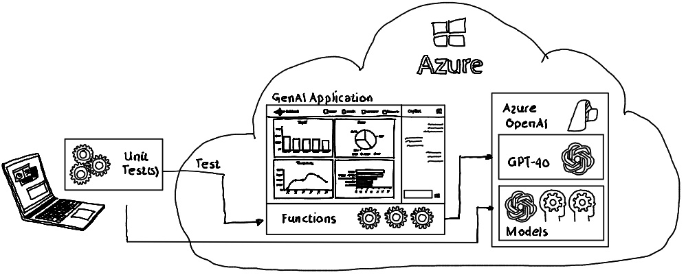

# GenAI Applications | Unit Test Evaluation

Unit testing of GenAI applications and agentic applications using the `Microsoft.Extensions.AI.Evaluation' nuget package.

## Intro

Integrating the testing of GenAI applications into existing DevOps pipelines is essential to ensure the reliability, safety, and quality of AI-driven solutions. 



Automated testing within the pipeline enables early detection of issues, continuous validation of model behavior, and rapid feedback for development teams.

Microsoft provides the `Microsoft.Extensions.AI.Evaluation` NuGet package, offering simple and powerful support for unit testing completion results from language models. This package streamlines the evaluation process, making it easier to validate and ensure the quality of AI-generated outputs by providing out-of-the box evaluators as well as foundation classes to build custom evaluators.

Unit tests can be executed on the local developer machine as well as fully integrated into automatic pipelines. The nuget package is environment agnostic allowing changing LLMs which evaluate GenAI functionality.

## Repo Content

This repository provides samples demonstrating how to:
- execute a single evaluator, 
- run multiple evaluators within one call, 
- build custom evaluators, 
- and implement caching for frequently occurring tests to reduce costs with report generation.

| Folder | Content | Description |
|---------------|--------------|---------------|
| [./setup](./setup/setup.azcli) | Azure CLI script | Creates all necessary Azure resources (OpenAI GPT-4o instance, resource group etc.) to perform model supported evaluations |
| [./config](./config/) | Application configuration | LLM API key, LLM endpoint, LLM deployment name |
| [./src/sdk](./src/sdk) | c# project | functionality to be unit tested |
| [./test](./test/) | c# XUnit test project | Unit tests |

## Sample(s)

### Execute Single Evaluator

Execution of a single evaluator. The used CoherenceEvaluator measures the readability and user-friendliness of the response being evaluated. It assesses the ability of an AI system to generate text that reads naturally, flows smoothly, and resembles human-like language in its responses.

CoherenceEvaluator returns a NumericMetric that contains a score for 'Coherence'. The score is a number between 1 and 5, with 1 indicating a poor score, and 5 indicating an excellent score. 

```csharp
[Fact]
    public async Task SingleEvaluator_Dev()
    {
        //Additional coder removed to increase readability...

        IEvaluator coherenceEvaluator = new CoherenceEvaluator();

        EvaluationResult evaluationResult = await coherenceEvaluator.EvaluateAsync(
            chatMessages,
            chatResponse,
            chatConfiguration
        );
    }
```

### Execute Multiple Evaluators

Multiple evaluators can be chained together and evaluated in a single call. This allows assessing different aspects of a model's output—such as coherence and relevance — simultaneously, streamlining the evaluation process and providing a comprehensive view.

```csharp
    [Fact]
    public async Task MultipleEvaluator_Dev()
    {
        //Additional coder removed to increase readability...

        IEvaluator coherenceEvaluator = new CoherenceEvaluator();
        IEvaluator relevanceEvaluator = new RelevanceEvaluator();

        IEvaluator compositeEvaluator = new CompositeEvaluator(coherenceEvaluator, relevanceEvaluator);
        EvaluationResult evaluationResult = await compositeEvaluator.EvaluateAsync(chatMessages, chatResponse, chatConfiguration);
    }
```

### Cache & Report Generation

Evaluations can be cached to avoid redundant calls and reduce operational costs, especially when tests are executed frequently. Core information required for creating reports can be stored either locally or in external storage accounts, enabling flexible and efficient management of evaluation results and reporting artifacts.

```csharp
[Fact]
    public async Task Reporting_Dev()
    {
       //Additional coder removed to increase readability...

        List<IEvaluator> reportingEvaluators = new List<IEvaluator>()
        {
            new CoherenceEvaluator(),
            new RelevanceEvaluator(),
        };

        string executionName = $"Execution-{DateTime.UtcNow:yyyy-MM-dd-HH-mm-ss}";
        ReportingConfiguration reportingConfiguration = DiskBasedReportingConfiguration.Create(
            storageRootPath: _reportingPath,
            evaluators: reportingEvaluators,
            chatConfiguration: chatConfiguration,
            enableResponseCaching: true,
            executionName: executionName
        );

        string scenarioName = "SuperSportsBallEvaluation";
        await using ScenarioRun scenarioRun =
            await reportingConfiguration.CreateScenarioRunAsync(
                scenarioName
        );

        EvaluationResult evaluationResult = await scenarioRun.EvaluateAsync(chatMessages, chatResponse);
    }
```

### Custom Evaluator

Custom evaluators can be easily added to address specific evaluation needs. In the sample below, a custom evaluator is provided that does not use a language model; instead, it simply checks whether certain key words are present in the model response. This demonstrates how to implement lightweight, domain-specific checks alongside or instead of LLM-based evaluations.

```csharp
public class CustomEvaluationEvaluator : IEvaluator
{
    private string _metricName = "KeyWordSearch";

    public IReadOnlyCollection<string> EvaluationMetricNames
    {
        get {
            return [
                _metricName
            ];
        }
    }
    
    private static int CheckForKeyWords(string? input)
    {
        // demo purpose only check 
        // if key words are present
        // in the LLM response
    }

    public ValueTask<EvaluationResult> EvaluateAsync(
        IEnumerable<ChatMessage> messages,
        ChatResponse modelResponse,
        ChatConfiguration? chatConfiguration = null,
        IEnumerable<EvaluationContext>? additionalContext = null,
        CancellationToken cancellationToken = default)
    {
        int keyPhraseCount = CheckForKeyWords(modelResponse.Text);

        string reason =
            $"'{_metricName}' metric has found {keyPhraseCount} key words.";

        NumericMetric numericMetric = new NumericMetric(
            _metricName,
            value: keyPhraseCount,
            reason
        );

        ProvideEvaluation(numericMetric);

        return new ValueTask<EvaluationResult>(new EvaluationResult(numericMetric));
    }
}
```


